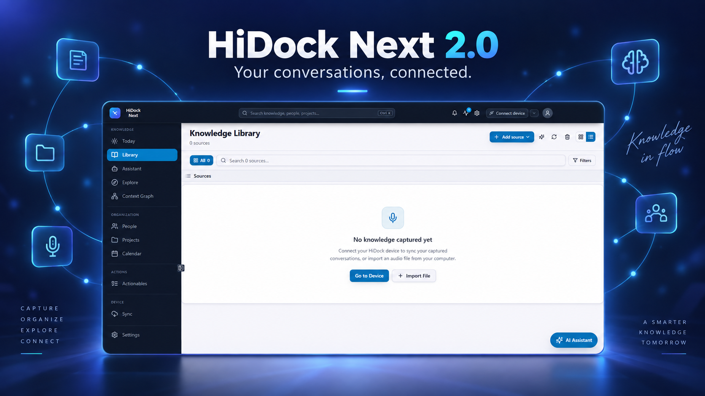
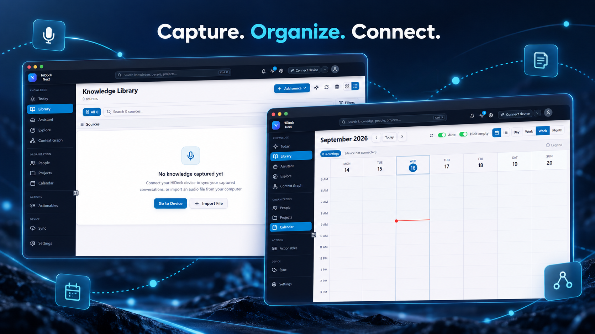
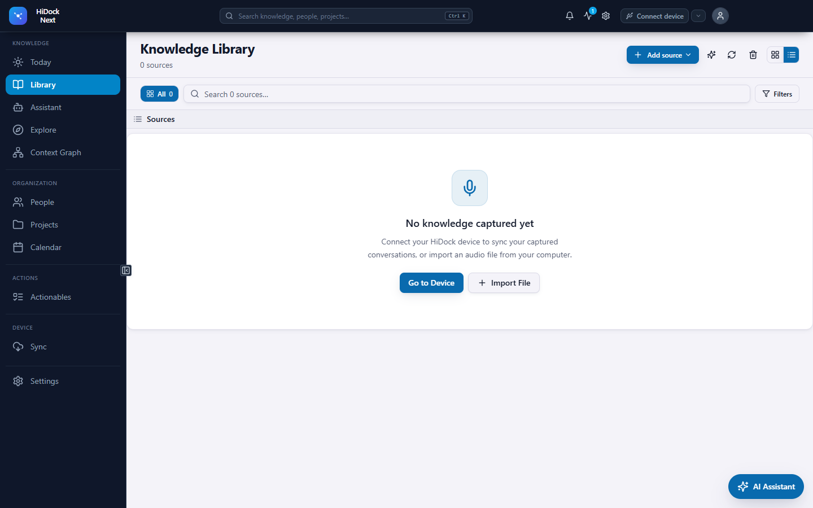
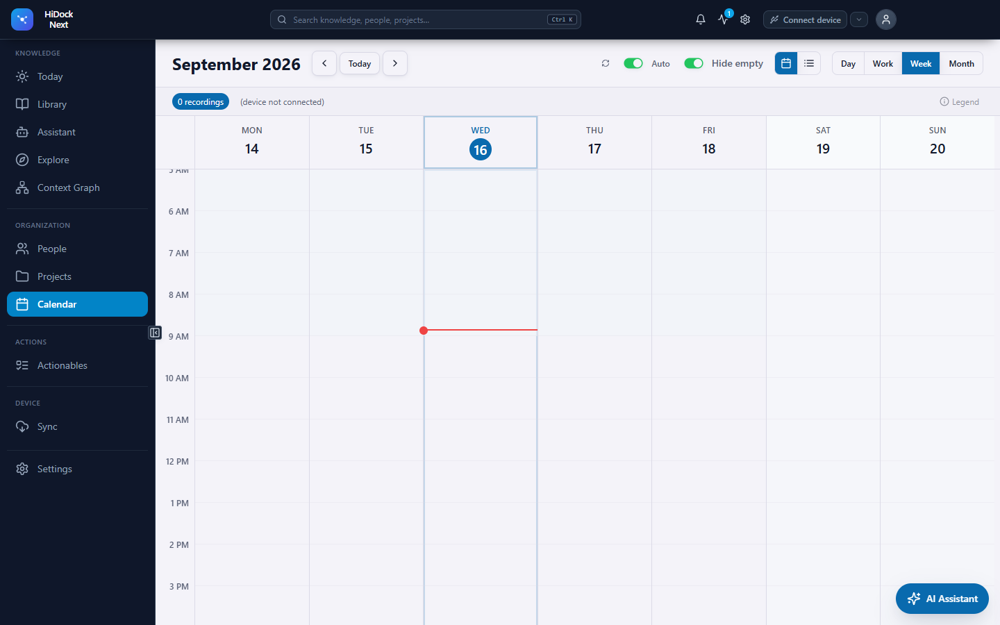

# HiDock Next 2.0



HiDock Next turns HiDock recordings into a private, searchable knowledge workspace. Download recordings directly from your device, transcribe them with your preferred provider, connect meetings and people, and turn conversations into summaries, decisions, projects, and action items.

> HiDock Next 2.0 is the full Electron application. If you only need lightweight device management, use [HiDock Light](https://github.com/sgeraldes/hidock-light).

## What you can do

- Manage H1, H1E, P1, and known hardware variants from one desktop app.
- Keep recordings, transcripts, metadata, and the knowledge graph local by default.
- Use Gemini, OpenAI-compatible providers, Ollama, or other configured AI providers.
- Match recordings to calendar events and identify recurring people and projects.
- Search across transcripts, summaries, decisions, action items, and linked context.
- Connect optional Microsoft 365 and Slack sources without making them mandatory.





## Install

Download the Windows installer from the [latest release](https://github.com/sgeraldes/hidock-next-2/releases/latest). macOS and Linux packages are planned; source builds are supported today.

## Build from source

Requirements: Node.js 22, npm, Git, and platform build tools for Electron native modules.

```bash
git clone https://github.com/sgeraldes/hidock-next-2.git
cd hidock-next-2

# Install and build the shared packages first.
for package in ai-providers calendar-sync connectors connectors-slack database jensen-protocol knowledge-graph transcription; do
  (cd "packages/$package" && npm ci && npm run build --if-present)
done

cd apps/electron
npm ci
npm run dev
```

On Windows, `build-electron.bat` installs dependencies and builds the app. `run-electron.bat` starts development mode.

## Screens

| Library | Calendar |
| --- | --- |
|  |  |

## Privacy and device safety

HiDock Next is local-first. API keys and account tokens must never be committed. Device operations are serialized, and the app uses a continuous polled read path to avoid locking the HiDock USB interface. Do not run exploratory USB scripts against a connected device.

## Community work carried into 2.0

The 2.0 extraction includes community fixes for local-calendar day handling and the H1 `0xB00C` product ID, plus field-tested P1 duration behavior. See [Community migration notes](docs/community-migration.md) for attribution and remaining roadmap items.

## Development

```bash
cd apps/electron
npm run typecheck
npm run lint
npm run test:run
npm run build
```

Contributions are welcome. Please read [the app contribution guide](apps/electron/CONTRIBUTING.md) and open an issue before starting a broad architectural change.

## Related project

- [HiDock Light](https://github.com/sgeraldes/hidock-light) — the focused Python desktop app for device management.
- [Legacy repository](https://github.com/sgeraldes/hidock-next) — archived history and migration notice.

HiDock is a trademark of its respective owner. This community project is not affiliated with or endorsed by HiDock.
